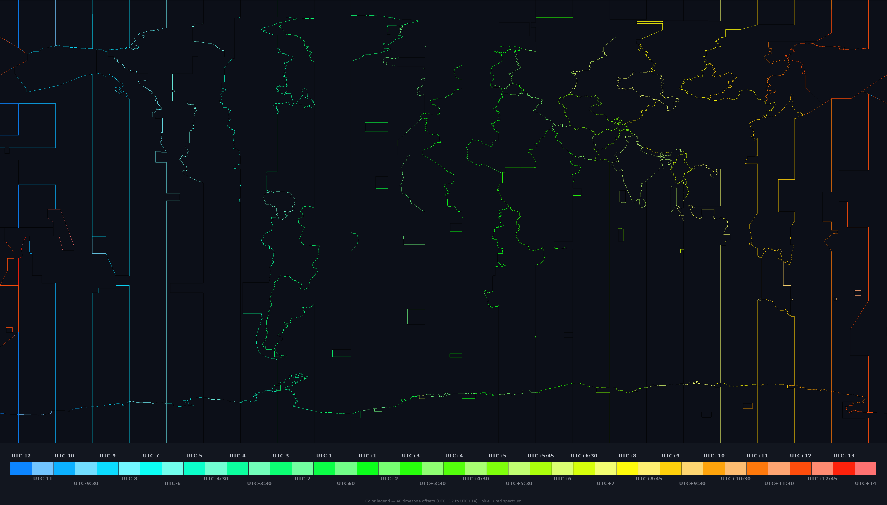

# Earth Timezone Borders for Google Earth Mobile

A lightweight Google Earth Mobile overlay for visualizing timezone borders without the lag from polygon-heavy KML files.

**The approach:** render timezone boundaries into a transparent PNG and load it as a KML `GroundOverlay`. One image, one KML entry. No panels, no tiles, no SuperOverlay.

Proven at 4096×2048 on a Snapdragon 888 / Android 13 device.



Each unique UTC offset gets **its own distinct color** — 40 offsets, 40 colors, arranged as a continuous spectrum from sky blue (UTC−12) to red (UTC+14). Adjacent offsets alternate between vivid and washed saturation so neighboring timezones are distinguishable at a glance.

## Methodology

### Problem

Google Earth Mobile (Samsung Z Flip 3) has multiple hard limits:

1. **SuperOverlay** (tiles + `NetworkLink`/`Region`/`Lod`) → rejected with "Unsupported element"
2. **Flat tile packs** (~951 PNGs) → "max external image limit reached" at ~22 references
3. **Single oversized texture** (e.g. 4096×2979 or 8192×5958) → partially renders (~25%) due to mobile GPU texture-size limits

### Solution

One `GroundOverlay`, one PNG, sized to the proven limit:

- **4096 × 2048** — the exact dimension confirmed to render fully
- **2-pass stroke**: black shadow (`width=2`, `alpha=190`) + colored core (`width=1`, `alpha=245`) with `joint="curve"`
- **Thin lines**: halo_width = `max(2, width//2048)`, line_width = `max(1, width//4096)`

This matches the first working prototype (the global yellow overlay) exactly, with coloring as the only change.

### Color assignment

Each of the 40 unique `zone` values from Natural Earth's DBF metadata is assigned a color by:

1. Sorting all offsets by numeric value → index $i$ from 0 (UTC−12) to 39 (UTC+14)
2. Hue: $210° \cdot (1 - i / 39)$ — linear from sky blue to red
3. Saturation: $0.95$ if $i$ is even (vivid), $0.55$ if odd (washed)
4. Value (brightness): always $1.0$ — no dark colors

No gradient, no interpolation. Each offset gets one fixed color.

## Download

**[v1.0 release](https://github.com/Metadrama/earth-timezones-google-earth-mobile/releases/tag/v1.0)**

| File | Size | Coverage | Resolution |
|------|------|----------|------------|
| `earth_timezones_raster_4k_spectrum.kmz` | ~169 KB | Global | 4096 × 2048 |

## Usage

1. Download the `.kmz` from the release.
2. Delete any previous timezone overlay from Google Earth Projects.
3. Open the `.kmz` with Google Earth Mobile (Android/iOS).

If importing from a file manager, choose Google Earth from the share/open-with menu.
If it does not appear, open Google Earth → Projects → Import KML/KMZ file.

## Rebuild

```bash
pip install Pillow
python3 src/build_all.py
```

This single command runs the full pipeline:

| Step | Script | What it produces |
|------|--------|-----------------|
| 1 | `core.py` | Shared config: color scheme, zone reader, KML template |
| 2 | `make_raster_overlay.py` | Transparent border PNG + KMZ archive |
| 3 | `make_legend.py` | Discrete-block color legend PNG |
| 4 | `make_preview.py` | README header composite (overlay + legend) |

Each step can also be run individually:

```bash
python3 src/make_raster_overlay.py --resolution "4k:4096x2048"
python3 src/make_legend.py
python3 src/make_preview.py
```

Custom resolution:

```bash
python3 src/make_raster_overlay.py --resolution "custom:2048x1024"
python3 src/make_preview.py --overlay dist/timezone_borders_raster_custom.png
```

## Files

| Path | Purpose |
|------|---------|
| `src/core.py` | Shared config: color scheme, zone reader, KML template |
| `src/make_raster_overlay.py` | Generator: shapefile → spectrum border PNG → KMZ |
| `src/make_legend.py` | Generator: zone DBF → discrete-block color legend |
| `src/make_preview.py` | Compositor: overlay + legend → README preview |
| `src/build_all.py` | Entry point: runs the full pipeline |
| `dist/earth_timezones_raster_4k_spectrum.kmz` | Global spectrum overlay (proven working) |
| `docs/preview-with-legend.png` | README preview — overlay + legend composite |
| `docs/preview-spectrum.png` | Standalone full-globe preview |
| `docs/legend-staggered.png` | Standalone color legend |

## Data source

- **Timezone boundaries:** [Natural Earth `ne_10m_time_zones`](https://www.naturalearthdata.com/downloads/10m-cultural-vectors/timezones/), public domain. Originally derived from the CIA World Factbook timezone map, adjusted to Natural Earth linework.

## Credits

- Cartography by [Natural Earth](https://www.naturalearthdata.com/), data donated by [International Mapping Associates, Inc.](http://internationalmapping.com/)
- Rendered with [Pillow](https://python-pillow.org/)
- Tested on Snapdragon 888 / Android 13

## License

MIT for project scripts and generated overlays. Natural Earth data is public domain.
