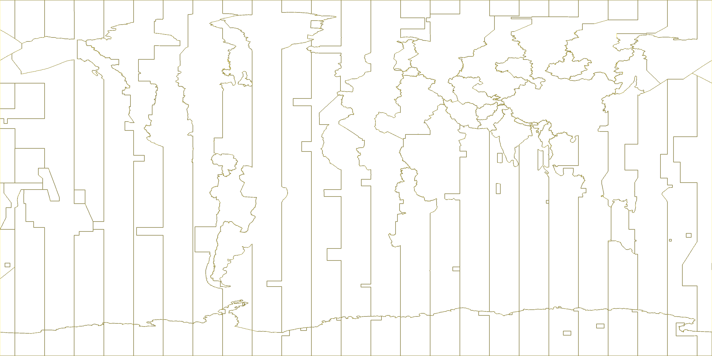

# Earth Timezone Borders for Google Earth Mobile

A lightweight Google Earth Mobile overlay for visualizing complete world timezone borders without the severe lag caused by polygon-heavy KML files.

The core trick is simple: **render the timezone boundaries into transparent raster images and load them as KML/KMZ `GroundOverlay`s**. Google Earth Mobile handles raster overlays far better than hundreds of vector polygons and rings.

The safest current mobile artifact is the Southeast Asia 16K neon paneled pack. It avoids unsupported KML SuperOverlay elements, avoids the hundreds-of-images limit, and avoids the mobile texture-size problem that caused single 4K/8K images to render only partially.

## Download

Use one of the files in [`dist/`](dist/):

- [`earth_timezones_regional_se_asia_10k_neon_panels.kmz`](dist/earth_timezones_regional_se_asia_10k_neon_panels.kmz) — **recommended for Google Earth Mobile**; Southeast Asia regional paneled overlay with 10K virtual detail split into 19 mobile-sized PNG panels.
- [`earth_timezones_regional_se_asia_8k_neon_panels.kmz`](dist/earth_timezones_regional_se_asia_8k_neon_panels.kmz) — conservative fallback with 12 panels when image-count limits are tight.
- [`earth_timezones_regional_se_asia_8k_neon.kmz`](dist/earth_timezones_regional_se_asia_8k_neon.kmz) — v0.1 one-image neon overlay; kept for comparison, but may partially render on mobile texture-limited devices.
- [`earth_timezones_regional_se_asia_4k_neon.kmz`](dist/earth_timezones_regional_se_asia_4k_neon.kmz) — v0.1 smaller one-image neon fallback; may still partially render on the tested phone.
- [`earth_timezones_regional_se_asia_8k.kmz`](dist/earth_timezones_regional_se_asia_8k.kmz) — previous yellow one-image overlay.
- [`earth_timezones_regional_se_asia_4k.kmz`](dist/earth_timezones_regional_se_asia_4k.kmz) — previous smaller yellow one-image overlay.
- [`earth_timezones_mobile_flat_se_asia_z9.kmz`](dist/earth_timezones_mobile_flat_se_asia_z9.kmz) — flat tiled experiment; avoids `NetworkLink`/`Region` but can hit Google Earth Mobile's max external image limit because it references 951 PNGs.
- [`earth_timezones_mobile_flat_se_asia_z8.kmz`](dist/earth_timezones_mobile_flat_se_asia_z8.kmz) — smaller flat tiled experiment; can still be limited by image-count caps.
- [`earth_timezones_tiled_superoverlay_z8.kmz`](dist/earth_timezones_tiled_superoverlay_z8.kmz) — desktop/advanced SuperOverlay experiment; uses `NetworkLink` and `Region`, which some Google Earth Mobile builds report as unsupported.
- [`earth_timezones_raster_4k.kmz`](dist/earth_timezones_raster_4k.kmz) — simple single-image overlay; fastest but soft when zoomed in.
- [`earth_timezones_raster_8k.kmz`](dist/earth_timezones_raster_8k.kmz) — sharper single-image overlay; still limited at country zoom.
- [`earth_timezones_raster_overlays.zip`](dist/earth_timezones_raster_overlays.zip) — both single-image KMZ files bundled together.
- [`legacy-vector-ultra-light.kml`](dist/legacy-vector-ultra-light.kml) — simplified vector experiment; included for comparison, not recommended for mobile.

## Preview



## Why this exists

Several world-timezone KML/KMZ files render as Google Earth “map features”. On mobile, that can become almost unusable because the app must manage a large number of polygon features, rings, vertices, fills, outlines, hit targets, and labels.

A simplified vector version reduces vertex count, but it still has two problems:

1. It remains a feature-heavy vector layer.
2. Strong simplification visibly damages border geometry.

This project uses a different approach: preserve the full Natural Earth timezone geometry during rendering, but bake the result into a transparent image. Google Earth Mobile then only has to draw one overlay texture.

## Files

### Mobile-safe low-count paneled regional overlays

- `earth_timezones_regional_se_asia_10k_neon_panels.kmz`
  - Region: Southeast Asia (`west=90`, `south=-15`, `east=145`, `north=25`)
  - Virtual image size: 10240 × 7447 px
  - Panel max size: 2048 × 2048 px
  - Internal contents: one `doc.kml` and 19 PNG panels
  - KMZ size: ~1.4 MB
  - Styling: timezone-coded alternating neon light cyan and neon magenta, with thicker black shadow and translucent glow for zoomed-out visibility.

- `earth_timezones_regional_se_asia_8k_neon_panels.kmz`
  - Same region and styling
  - Virtual image size: 8192 × 5958 px
  - Panel max size: 2048 × 2048 px
  - Internal contents: one `doc.kml` and 12 PNG panels
  - KMZ size: ~1.0 MB
  - Conservative fallback if the 10K/19-panel version hits device image-count limits.

Note: The 12K (26 panels) and 16K (40 panels) variants exceeded the image-count limit during testing and have been removed.

This is the current compatibility target: few enough images to avoid the image-count cap, but each image small enough to avoid mobile texture-size clipping.

### Mobile-safe regional one-image overlays

- `earth_timezones_regional_se_asia_8k_neon.kmz`
  - Region: Southeast Asia (`west=90`, `south=-15`, `east=145`, `north=25`)
  - Image size: 8192 × 5958 px
  - KMZ size: ~248 KB
  - Internal contents: one `doc.kml` and one PNG image
  - Styling: timezone-coded alternating neon light cyan and neon magenta, with thicker black shadow and translucent glow for zoomed-out visibility.
  - Recommended for Google Earth Mobile after testing exposed both `NetworkLink`/`Region` rejection and a max external image-count limit.

- `earth_timezones_regional_se_asia_4k_neon.kmz`
  - Same region and KML compatibility profile
  - Image size: 4096 × 2979 px
  - KMZ size: ~89 KB
  - Smaller neon fallback if the 8K regional image is too heavy for a device.

- `earth_timezones_regional_se_asia_8k.kmz`
  - Region: Southeast Asia (`west=90`, `south=-15`, `east=145`, `north=25`)
  - Image size: 8192 × 5958 px
  - KMZ size: ~161 KB
  - Internal contents: one `doc.kml` and one PNG image
  - Previous yellow-line version.

- `earth_timezones_regional_se_asia_4k.kmz`
  - Same region and KML compatibility profile
  - Image size: 4096 × 2979 px
  - KMZ size: ~60 KB
  - Previous smaller yellow-line version.

This is the strictest mobile compatibility path: one georeferenced raster image, one `GroundOverlay`, no tile image flood.

### Flat tiled regional overlays

- `earth_timezones_mobile_flat_se_asia_z9.kmz`
  - Region: Southeast Asia (`west=90`, `south=-15`, `east=145`, `north=25`)
  - Tile zoom: z9
  - Tile size: 512 × 512 px
  - KMZ size: ~661 KB
  - Internal contents: one `doc.kml` and 951 PNG tiles
  - Uses only `GroundOverlay` + `LatLonBox`; no `NetworkLink`, `Region`, or `Lod`.
  - Can hit Google Earth Mobile's max external image limit.

- `earth_timezones_mobile_flat_se_asia_z8.kmz`
  - Same region and KML compatibility profile
  - Tile zoom: z8
  - KMZ size: ~360 KB
  - Internal contents: one `doc.kml` and 457 PNG tiles

Flat tiled packs are kept as experiments. They avoid unsupported KML elements, but Google Earth Mobile may refuse to fetch more images once its internal limit is reached.

### Tiled SuperOverlay

- `earth_timezones_tiled_superoverlay_z8.kmz`
  - Maximum tile zoom: z8
  - Tile size: 512 × 512 px
  - KMZ size: ~30 MB
  - Internal contents: 42,454 KML files and 18,752 PNG tiles
  - Desktop/advanced experiment. Some Google Earth Mobile builds reject its required `NetworkLink` and `Region` elements.

The tiled KMZ uses KML `Region` and `Lod` so Google Earth can request child tiles only when that region becomes large enough on screen. At z8 with 512 px tiles, a 5°-wide Peninsular Malaysia view has roughly 1,800 px of source raster detail across the viewport.

### Single-image raster overlays

- `earth_timezones_raster_4k.kmz`
  - Image size: 4096 × 2048
  - KMZ size: ~127 KB
  - Best for speed and general mobile use.

- `earth_timezones_raster_8k.kmz`
  - Image size: 8192 × 4096
  - KMZ size: ~323 KB
  - Better visual sharpness when zooming in.

Each KMZ contains:

```text
doc.kml
files/timezone_borders_raster_*.png
```

The KML uses:

```xml
<GroundOverlay>
  <Icon><href>files/timezone_borders_raster_8k.png</href></Icon>
  <LatLonBox>
    <north>90</north>
    <south>-90</south>
    <east>180</east>
    <west>-180</west>
  </LatLonBox>
</GroundOverlay>
```

### Legacy vector experiment

`legacy-vector-ultra-light.kml` is a simplified vector KML created during testing. It is kept because it shows why simplification alone is not enough: Google Earth Mobile can still lag, and geometry loss becomes visible.

## Methodology

### Data source

The timezone boundaries come from Natural Earth’s public-domain `ne_10m_time_zones` dataset:

- Source page: <https://www.naturalearthdata.com/downloads/10m-cultural-vectors/timezones/>
- Download used: <https://naciscdn.org/naturalearth/10m/cultural/ne_10m_time_zones.zip>

Natural Earth describes this dataset as derived primarily from the CIA World Factbook timezone map, adjusted to Natural Earth linework and updated for several timezone changes.

### Processing steps

For the recommended paneled strict mobile regional overlay:

1. Download `ne_10m_time_zones.zip` from Natural Earth.
2. Read the ESRI Shapefile polygon rings and DBF timezone metadata directly.
3. Define one high-resolution virtual regional raster.
4. Split it into a small grid of max-2048 px panels.
5. Clip/render visible timezone border segments into each panel.
6. Color-code segments from timezone offset metadata: whole-hour zones alternate between neon light cyan and neon magenta, with half-hour/quarter-hour zones deterministically assigned from half-hour steps.
7. Draw each panel with thicker black shadow, translucent neon glow, and bright neon core strokes.
8. Write a single `doc.kml` containing one `GroundOverlay` per non-empty panel.
9. Package `doc.kml` and the panel PNGs into a KMZ.

For the v0.1 one-image regional overlay:

1. Download `ne_10m_time_zones.zip` from Natural Earth.
2. Read the ESRI Shapefile polygon rings directly.
3. Clip/render visible timezone border segments inside the target regional bounding box.
4. Color-code segments from the timezone offset metadata: whole-hour zones alternate between neon light cyan and neon magenta, with half-hour/quarter-hour zones deterministically assigned from half-hour steps.
5. Render those segments into one transparent regional PNG image with thicker black shadow, translucent neon glow, and bright neon core strokes.
6. Write a single `doc.kml` containing one `GroundOverlay` for that PNG.
7. Package `doc.kml` and the one PNG into a KMZ.

For the flat tiled regional overlays:

1. Download `ne_10m_time_zones.zip` from Natural Earth.
2. Read the ESRI Shapefile polygon rings directly.
3. Convert polygon rings into border line segments.
4. Select only z8/z9 tiles intersecting the target regional bounding box.
5. Render touched line segments into transparent 512 × 512 PNG tiles.
6. Skip empty PNG tiles.
7. Write a single `doc.kml` containing one simple `GroundOverlay` per PNG tile.
8. Do **not** emit `NetworkLink`, `Region`, or `Lod`, because some Google Earth Mobile builds report those as unsupported.
9. Package `doc.kml` and the PNG tile tree into one KMZ.

For the SuperOverlay experiment:

1. Download `ne_10m_time_zones.zip` from Natural Earth.
2. Read the ESRI Shapefile polygon rings directly.
3. Convert polygon rings into border line segments.
4. For each zoom level from z0 through z8, find tiles touched by those segments.
5. Render only the touched line segments into transparent 512 × 512 PNG tiles.
6. Skip empty PNG tiles.
7. Write one KML file per tile with:
   - a `GroundOverlay` for that tile's PNG
   - `Region` / `Lod` rules
   - `NetworkLink`s to child tiles
8. Package the hierarchy into one KMZ.

For the older single-image overlays, the process is simpler: render all polygon rings onto one transparent RGBA world image and package that PNG as a global `GroundOverlay`.

The raster approach keeps detailed source boundaries visually, while avoiding mobile vector feature overhead.

## Rebuild

Install Pillow if needed:

```bash
python3 -m pip install Pillow
```

Then rebuild the recommended Google Earth Mobile paneled regional pack:

```bash
python3 src/make_panel_overlay.py --width 10240 --panel-size 2048 --label se_asia_10k_neon_panels
```

That writes:

```text
dist/earth_timezones_regional_se_asia_10k_neon_panels.kmz
```

Conservative fallback paneled build:

```bash
python3 src/make_panel_overlay.py --width 8192 --panel-size 2048 --label se_asia_8k_neon_panels
```

To rebuild the v0.1 one-image regional pack:

```bash
python3 src/make_regional_raster_overlay.py --width 8192 --label se_asia_8k_neon
```

That writes:

```text
dist/earth_timezones_regional_se_asia_8k_neon.kmz
```

Custom one-image regional build example:

```bash
python3 src/make_regional_raster_overlay.py \
  --width 8192 \
  --bbox 90,-15,145,25 \
  --label se_asia_8k_neon
```

To rebuild the flat tiled regional experiment:

```bash
python3 src/make_mobile_flat_overlay.py --max-zoom 9
```

That writes:

```text
dist/earth_timezones_mobile_flat_se_asia_z9.kmz
```

Custom regional build example:

```bash
python3 src/make_mobile_flat_overlay.py \
  --max-zoom 9 \
  --tile-size 512 \
  --bbox 90,-15,145,25 \
  --outdir dist/mobile-flat-se-asia-z9 \
  --kmz dist/earth_timezones_mobile_flat_se_asia_z9.kmz
```

To rebuild the desktop/advanced SuperOverlay experiment:

```bash
python3 src/make_tiled_overlay.py
```

That writes:

```text
dist/earth_timezones_tiled_superoverlay_z8.kmz
```

Custom tiled build example:

```bash
python3 src/make_tiled_overlay.py \
  --max-zoom 8 \
  --tile-size 512 \
  --outdir dist/tiled-superoverlay \
  --kmz dist/earth_timezones_tiled_superoverlay_z8.kmz
```

To rebuild the older single-image overlays:

```bash
python3 src/make_raster_overlay.py
```

The scripts download Natural Earth’s `ne_10m_time_zones.zip`, extract the shapefile, render the overlays, and package KMZ files in `dist/`.

Custom output/resolution example:

```bash
python3 src/make_raster_overlay.py \
  --outdir dist \
  --resolution 4k:4096x2048 \
  --resolution 8k:8192x4096
```

## Mobile performance notes

Google Earth Mobile is the constraint here, not the timezone dataset.

Vector KML is expensive on mobile because every timezone polygon can become an interactive map feature. Even a 100 KB vector KML can feel worse than a 300 KB raster KMZ if it contains many rings and features.

A single raster `GroundOverlay` changes the workload:

- from: many vector features + labels + hit detection + tessellation
- to: one georeferenced texture

That is why the single-image raster KMZ is smoother than vector KML. But a single global raster gets blurry at close zoom unless it becomes enormous.

The current strict mobile regional pack uses low-count panels:

- one `doc.kml`
- 12–19 `GroundOverlay`s
- 12–19 referenced PNGs
- each panel stays at or below 2048 px per side
- no tile image flood, so it avoids the max external image-count limit
- no huge single texture, so it avoids the partial-render problem seen with one-image 4K/8K packs

The v0.1 one-image regional pack uses one image only. It avoids the image-count limit, but on the tested phone even the 4K/8K single texture rendered only partially, so it is no longer recommended.

The flat tiled regional packs use flat `GroundOverlay` entries only:

- all overlay tiles are listed in one `doc.kml`
- unsupported `NetworkLink`, `Region`, and `Lod` elements are avoided
- but many PNG references can still hit Google Earth Mobile's image-count cap

The SuperOverlay experiment fixes the single-image blur problem in desktop-capable KML clients:

- low zoom uses low-detail parent tiles
- close zoom loads high-detail child tiles only near the camera
- empty tiles are skipped
- parent overlays stop displaying when child overlays become detailed enough

## Limitations

- The overlay is visual only. You cannot tap a timezone polygon to inspect metadata.
- The recommended 10K paneled neon file uses 19 PNG panels; if a device has image-count limits, use the 8K/12-panel fallback.
- The flat regional tiled packs can hit Google Earth Mobile's max external image limit because they reference hundreds of PNGs.
- The SuperOverlay KMZ contains many small internal files and uses `NetworkLink` / `Region`; some Google Earth Mobile builds report those elements as unsupported.
- The single-image raster files will blur if zoomed in far enough.
- The images use geographic/equirectangular tile bounds through KML `LatLonBox`; polar and high-latitude visual distortion follows the usual world-rectangle projection behavior.
- Daylight saving time is not represented. This is a timezone-border overlay, not a current-local-time calculator.

## Future work

Potential next improvements:

- Build more mobile-safe regional packs, e.g. Europe, North America, or global low-zoom packs.
- If the 10K/19-panel version still hits the image-count limit, test the 8K/12-panel fallback and report back so the threshold can be confirmed precisely.
- Add CI to rebuild and validate KMZ artifacts.

## Credits

- Timezone boundary data: [Natural Earth](https://www.naturalearthdata.com/), public domain.
- Natural Earth timezone data donated by [International Mapping Associates, Inc.](http://internationalmapping.com/), with original timezone reference material from the CIA World Factbook as described by Natural Earth.
- KML/KMZ format: [Google Earth KML documentation](https://developers.google.com/kml/documentation/).
- Rendering: [Pillow](https://python-pillow.org/).
- Built for Google Earth Mobile use after vector timezone KML files proved too laggy in practice.

## License

Project scripts and generated overlay packaging are released under the MIT License.

Natural Earth data is public domain. See Natural Earth’s terms: <https://www.naturalearthdata.com/about/terms-of-use/>.
