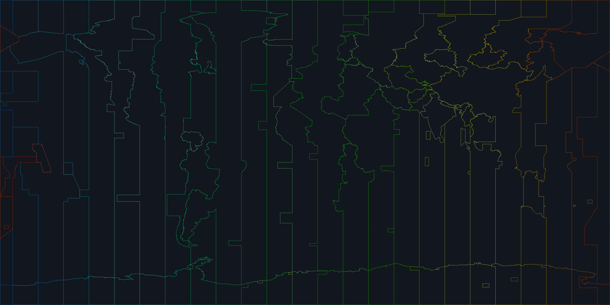

# Earth Timezone Borders for Google Earth Mobile

A lightweight Google Earth Mobile overlay for visualizing timezone borders without the lag from polygon-heavy KML files.

**The approach:** render timezone boundaries into a transparent PNG and load it as a KML `GroundOverlay`. One image, one KML entry. No panels, no tiles, no SuperOverlay.

Proven at 4096×2048 on a Samsung Z Flip 3 (SM-F711B).



## Color coding

Each unique UTC offset gets **its own distinct color**. 40 offsets → 40 colors. The pattern follows a spectrum from sky blue (UTC-12) to red (UTC+14), with adjacent offsets alternating between vivid and washed saturation so neighboring timezones never blend together.

| Zone | Color | Zone | Color |
|------|-------|------|-------|
| UTC−12 | sky blue vivid | UTC−11 | sky blue washed |
| UTC−10 | bright blue vivid | UTC−9:30 | bright blue washed |
| UTC−9 | cyan vivid | UTC−8 | cyan washed |
| UTC−7 | teal vivid | UTC−6 | teal washed |
| UTC−5 | green vivid | UTC−4:30 | green washed |
| UTC−4 | emerald vivid | UTC−3:30 | emerald washed |
| UTC−3 | bright green vivid | UTC−2 | bright green washed |
| UTC−1 | lime vivid | UTC±0 | lime washed |
| UTC+1 | leaf green vivid | UTC+2 | leaf green washed |
| UTC+3 | yellow-green vivid | UTC+3:30 | yellow-green washed |
| UTC+4 | neon green vivid | UTC+4:30 | neon green washed |
| UTC+5 | vivid green vivid | UTC+5:30 | vivid green washed |
| UTC+5:45 | bright chartreuse vivid | UTC+6 | bright chartreuse washed |
| UTC+6:30 | lime yellow vivid | UTC+7 | lime yellow washed |
| UTC+8 | yellow vivid | UTC+8:45 | yellow washed |
| UTC+9 | gold vivid | UTC+9:30 | gold washed |
| UTC+10 | orange vivid | UTC+10:30 | orange washed |
| UTC+11 | deep orange vivid | UTC+11:30 | deep orange washed |
| UTC+12 | red vivid | UTC+12:45 | red washed |
| UTC+13 | bright red vivid | UTC+14 | soft red washed |

**Rule of thumb:** cool colors = earlier offsets, warm colors = later offsets.  
**Vivid vs washed:** adjacent timezone offsets always alternate — easy to tell apart at a glance.

## Methodology

### Problem

Google Earth Mobile (Samsung Z Flip 3) has multiple hard limits:

1. **SuperOverlay** (tiles + `NetworkLink`/`Region`/`Lod`) → rejected with "Unsupported element"
2. **Flat tile packs** (~951 PNGs) → "max external image limit reached" at ~22 references
3. **Single oversized texture** (e.g. 4096×2979 or 8192×5958) → partially renders (~25%) due to mobile GPU texture-size limits

### Solution

One `GroundOverlay`, one PNG, sized to the proven limit:

- **4096 × 2048** — the exact dimension confirmed to render fully
- **2-pass stroke**: black shadow (`width=2`, `alpha=190`) + colored core (`width=1`, `alpha=245`) with `joint="curve"`
- **Thin lines**: halo_width = `max(2, width//2048)`, line_width = `max(1, width//4096)`

This matches the first working prototype (the global yellow overlay) exactly, with coloring as the only change.

### Color assignment

Each of the 40 unique `zone` values from Natural Earth's DBF metadata is assigned a color by:

1. Sorting all offsets by numeric value → index $i$ from 0 (UTC−12) to 39 (UTC+14)
2. Hue: $210° \cdot (1 - i / 39)$ — linear from sky blue to red
3. Saturation: $0.95$ if $i$ is even (vivid), $0.55$ if odd (washed)
4. Value (brightness): always $1.0$ — no dark colors

No gradient, no interpolation. Each offset gets one fixed color.

## Download

**[v1.0 release](https://github.com/Metadrama/earth-timezones-google-earth-mobile/releases/tag/v1.0)**

| File | Size | Coverage | Resolution |
|------|------|----------|------------|
| `earth_timezones_raster_4k_spectrum.kmz` | ~169 KB | Global | 4096 × 2048 |

## Usage

1. Download the `.kmz` from the release.
2. Delete any previous timezone overlay from Google Earth Projects.
3. Open the `.kmz` with Google Earth Mobile (Android/iOS).

If importing from a file manager, choose Google Earth from the share/open-with menu.
If it does not appear, open Google Earth → Projects → Import KML/KMZ file.

## Rebuild

```bash
pip install Pillow
python3 src/make_raster_overlay.py --resolution "4k:4096x2048"
```

The script downloads Natural Earth's `ne_10m_time_zones.zip`, reads the shapefile rings and DBF zone metadata, renders spectrum-colored borders onto a transparent PNG, and packages as a KMZ.

Custom resolution:

```bash
python3 src/make_raster_overlay.py --resolution "custom:2048x1024"
```

## Files

| Path | Purpose |
|------|---------|
| `src/make_raster_overlay.py` | Generator: shapefile → spectrum PNG → KMZ |
| `dist/earth_timezones_raster_4k_spectrum.kmz` | Global spectrum overlay (proven working) |
| `docs/preview-spectrum.png` | Full-globe preview on dark background |
| `docs/color-legend.png` | All 40 offset colors |

## Data source

- **Timezone boundaries:** [Natural Earth `ne_10m_time_zones`](https://www.naturalearthdata.com/downloads/10m-cultural-vectors/timezones/), public domain. Originally derived from the CIA World Factbook timezone map, adjusted to Natural Earth linework.

## Credits

- Cartography by [Natural Earth](https://www.naturalearthdata.com/), data donated by [International Mapping Associates, Inc.](http://internationalmapping.com/)
- Rendered with [Pillow](https://python-pillow.org/)
- Tested on Samsung Galaxy Z Flip 3 (SM-F711B) running Google Earth Mobile

## License

MIT for project scripts and generated overlays. Natural Earth data is public domain.
